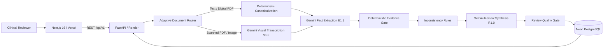

# Sanitas - AI Clinical Document Reviewer

Sanitas is an evidence-grounded AI system for reviewing **synthetic clinical documents**. It accepts plain text, digital PDFs, scanned PDFs, and document images; converts them into a canonical source representation; extracts structured clinical facts with Google Gemini; verifies every cited source deterministically; detects document-level inconsistencies; synthesizes a structured review; and persists results for history and durable report links.

> **Safety scope:** Sanitas is an engineering and evaluation project for synthetic clinical data only. It is not a medical device, does not provide medical advice, and is not intended for real patient data or PHI.

## Live Application

- **Frontend:** https://sanitas-peach.vercel.app
- **Backend API:** https://sanitas-api.onrender.com
- **API health:** https://sanitas-api.onrender.com/health
- **In-app technical docs:** https://sanitas-peach.vercel.app/docs

## Why Sanitas

Clinical documents are messy: important facts can be scattered across pages, scans can be partially unreadable, and generative models can produce plausible but unsupported output. Sanitas is designed around a stricter principle: **evidence before synthesis**.

Every supported extracted fact carries a source reference. The backend independently checks that the referenced segment exists, that the page number matches, and that the quoted text is present in the canonical document. Structured AI output is therefore only one stage in the pipeline, not the final source of truth.

## Key Features

- **Multi-modal intake:** plain text, digital PDF, scanned/visual PDF, JPEG, and PNG.
- **Adaptive document routing:** native PyMuPDF extraction for text-rich PDFs; Gemini visual transcription for scanned or image-based documents.
- **Canonical source model:** stable `p{page}-s{sequence}` segment IDs preserve page-level provenance.
- **Two-pass AI pipeline:** schema-constrained fact extraction (`E1.1`) followed by grounded review synthesis (`R1.0`).
- **Deterministic evidence validation:** unsupported segment IDs, page references, or quotes fail closed.
- **Deterministic inconsistency checks:** flags document-level contradictions such as explicit NKDA alongside a named allergy or conflicting medication status.
- **Explicit uncertainty:** supported, uncertain, and conflicting states are represented rather than silently resolved.
- **Structured clinical review:** report summary, concerns, missing information, inconsistencies, and items requiring review.
- **Persistent history:** analyses and processing metadata are stored in PostgreSQL and can be reopened through durable report URLs.
- **Typed reliability model:** validation, parsing, provider, evidence, quality-gate, and database failures map to safe application errors.
- **Interactive technical documentation:** architecture and methodology are also available in the deployed `/docs` portal.

## Architecture



### Processing Pipeline

1. **Ingestion and routing** - validates request shape, file type/signature, size, and page limits; computes SHA-256; classifies the document.
2. **Canonicalization** - builds page-aware immutable source segments.
3. **Fact extraction** - Gemini returns schema-constrained clinical entities with evidence references.
4. **Evidence verification** - application code verifies source segment, page number, and verbatim quote.
5. **Inconsistency detection** - deterministic rules detect document-level contradictions without making medical inferences.
6. **Review synthesis** - Gemini receives validated extraction plus inconsistency candidates and produces a structured review.
7. **Quality gate** - cross-references entity IDs and evidence and applies a secondary safeguard against prescriptive directives.
8. **Persistence** - analysis state, structured output, timings, model/prompt versions, and audit events are stored in PostgreSQL.

## Supported Inputs and Bounds

| Input | Processing path | Current bound |
|---|---|---:|
| Plain text | Deterministic segmentation | 50,000 characters |
| Digital PDF | PyMuPDF native extraction | 10 MB, 15 pages |
| Scanned / visual PDF | Bounded rendering + Gemini visual transcription | 10 MB, 15 pages |
| JPEG / PNG | Pillow validation + Gemini visual transcription | 10 MB |

Visual document processing is bounded to reduce memory pressure: scanned pages are rendered at controlled resolution before multimodal transcription.

## Structured Output

The report combines two layers:

### Extracted facts

- Patient information
- Symptoms
- Diagnoses / clinical conditions
- Medications
- Vital signs
- Allergies
- Clinical observations
- Uncertain items

### Review findings

- Report summary
- Clinical concerns
- Missing / incomplete information
- Potential inconsistencies
- Items requiring review

The frontend presents these as readable review sections rather than raw model JSON, with evidence links back to source segments.

## Evidence Grounding

An evidence reference has the form:

```json
{
  "segment_id": "p2-s4",
  "page_number": 2,
  "quote": "Metformin 500 mg BID"
}
```

The backend verifies that:

1. the referenced segment exists;
2. the page number matches;
3. the quote occurs in that segment after controlled whitespace normalization.

If evidence validation fails, the analysis is not presented as a verified result.

## Reliability and Failure Handling

Sanitas uses typed errors for expected failure modes, including:

- empty or multiple inputs;
- oversized text/files;
- unsupported or mismatched file types;
- corrupt PDFs/images and PDF page-limit violations;
- document parsing/transcription failures;
- Gemini rate limits, timeouts, unavailability, or malformed structured responses;
- evidence-validation and review-quality failures;
- database availability/write failures.

Provider internals and stack traces are not returned to users. Clinical source text is not intended for application telemetry or error payloads.

## Persistence

Production persistence uses **Neon PostgreSQL** through SQLAlchemy 2.x and Alembic.

The database stores:

- analysis UUID and status;
- source type, filename metadata, SHA-256, size, and page count;
- document quality metadata;
- canonical document JSON;
- validated clinical extraction JSON;
- clinical review JSON;
- model and prompt versions;
- stage timing metadata;
- timestamps and safe error metadata;
- processing-event records.

Original uploaded file bytes are not stored in PostgreSQL.

## API

### `GET /health`

Dependency-light liveness endpoint.

### `POST /api/v1/analyses`

Accepts either:

```json
{
  "text": "Synthetic clinical note..."
}
```

or multipart form data containing exactly one of `text` or `file`.

### `GET /api/v1/analyses`

Returns paginated analysis-history metadata.

### `GET /api/v1/analyses/{analysis_id}`

Returns a persisted analysis and complete structured report.

### `GET /api/v1/analyses/{analysis_id}/status`

Returns lightweight analysis status metadata.

## Technology Stack

### Frontend

- Next.js 16.3.6
- React 19.3
- TypeScript 6
- TanStack Query 5
- Mermaid 12
- Vercel

### Backend

- Python 3.12
- FastAPI
- Pydantic v2
- Google GenAI SDK
- PyMuPDF
- Pillow
- SQLAlchemy 2.x
- Alembic
- Psycopg 3
- Render

### Data and AI

- Neon PostgreSQL
- Google Gemini API
- Default configured model: `gemini-3.8-flash`
- Prompt versions: `V1.0`, `E1.1`, `R1.0`

## Repository Structure

```text
Sanitas/
├── apps/
│   ├── api/
│   │   ├── app/
│   │   │   ├── api/routes/        # REST endpoints
│   │   │   ├── core/              # settings + typed errors
│   │   │   ├── db/                # SQLAlchemy models/session
│   │   │   ├── schemas/           # Pydantic contracts
│   │   │   └── services/          # routing, AI, evidence, quality gates
│   │   ├── alembic/               # database migrations
│   │   ├── eval/                  # synthetic evaluation suite
│   │   └── tests/                 # backend automated tests
│   └── web/
│       └── app/
│           ├── components/
│           ├── docs/              # interactive documentation portal
│           ├── history/           # analysis history
│           ├── review/[id]/       # durable report permalinks
│           └── workbench/         # review workflow
├── docs/
│   ├── architecture.md
│   ├── ai-design.md
│   ├── evaluation.md
│   └── technical-decisions.md
├── .github/workflows/ci.yml
└── render.yaml
```

## Local Setup

### Backend

```bash
cd apps/api
python -m venv .venv

# Windows PowerShell
.\.venv\Scripts\Activate.ps1

# macOS/Linux
# source .venv/bin/activate

python -m pip install -r requirements.txt
cp .env.example .env  # use Copy-Item on PowerShell
```

Configure at least:

```env
GEMINI_API_KEY=...
GEMINI_MODEL=gemini-3.8-flash
DATABASE_URL=postgresql+psycopg://...
CORS_ALLOWED_ORIGINS=http://localhost:3000
MAX_TEXT_CHARS=50000
MODEL_TIMEOUT_SECONDS=90
```

Apply database migrations:

```bash
alembic upgrade head
```

Run the API:

```bash
uvicorn app.main:app --reload --port 8000
```

- Swagger UI: http://localhost:8000/docs
- Health: http://localhost:8000/health

### Frontend

```bash
cd apps/web
npm ci
cp .env.example .env.local  # use Copy-Item on PowerShell
npm run dev
```

Configure:

```env
NEXT_PUBLIC_API_BASE_URL=http://localhost:8000
```

Open http://localhost:3000.

## Testing

### Backend

```bash
cd apps/api
python -m pip check
pytest -v
python -m app.smoke
```

The current repository contains **33 automated backend tests** covering configuration, validation, canonicalization, multimodal routing, evidence verification, inconsistency rules, quality gates, provider-error mapping, persistence/history, and prompt-injection handling.

### Frontend

```bash
cd apps/web
npm run lint
npm run typecheck
npm run build
```

GitHub Actions runs the backend and frontend validation suites on every push to `main` and on pull requests.

## Evaluation

Sanitas deliberately separates deterministic regression testing from empirical model benchmarking.

```bash
cd apps/api

# Offline structural regression suite
python -m eval.runner --mock

# Live Gemini benchmark - requires GEMINI_API_KEY
python -m eval.runner --live
```

The repository currently contains **7 curated synthetic benchmark cases** used for structural regression coverage. The live runner calculates precision, recall, F1, evidence-validity rate, and p50/p95 latency from actual Gemini executions.

**No live-model accuracy number is claimed here because the repository snapshot does not include a persisted live benchmark result artifact.** This avoids presenting mocked or unverified results as model performance.

See [`docs/evaluation.md`](docs/evaluation.md) for the methodology.

## Deployment

### Backend - Render

The repository includes `render.yaml`.

- Root directory: `apps/api`
- Build command: `pip install -r requirements.txt`
- Start command: `uvicorn app.main:app --host 0.0.0.0 --port $PORT`
- Health check: `/health`

Production environment variables include `GEMINI_API_KEY`, `DATABASE_URL`, `CORS_ALLOWED_ORIGINS`, and model/input configuration.

### Frontend - Vercel

- Root directory: `apps/web`
- Framework: Next.js
- Environment variable:

```env
NEXT_PUBLIC_API_BASE_URL=https://sanitas-api.onrender.com
```

Production backend CORS should allow the deployed Vercel origin.

## Design Decisions

Several deliberately simple choices keep the project explainable and proportionate:

- **No LangGraph / agent framework:** the pipeline is deterministic orchestration with bounded model calls, so an agent runtime adds little value.
- **No RAG/vector database:** the task is document review, not external medical knowledge retrieval.
- **Native PDF fast path:** PyMuPDF avoids unnecessary multimodal inference for text-rich PDFs.
- **Gemini visual fallback:** scanned PDFs/images use multimodal transcription rather than a separate OCR service.
- **No raw upload persistence:** only structured/canonical artifacts and metadata are persisted.
- **Synchronous pipeline:** appropriate for the bounded assignment workload; async workers can be introduced later if measured latency requires them.
- **PostgreSQL JSONB:** preserves structured reports while retaining a conventional relational audit model.

See [`docs/technical-decisions.md`](docs/technical-decisions.md) for details.

## Known Limitations

- Synthetic clinical data only; not designed or validated for PHI or production clinical use.
- Visual transcription quality depends on scan quality and model capability; handwriting and severely degraded scans may remain uncertain.
- The pipeline is synchronous and bounded to 10 MB / 15-page documents.
- Model output depends on an external Gemini service and its availability/rate limits.
- The system intentionally does not use external medical knowledge to infer undocumented facts.
- No authentication or multi-user access control is included in the assignment scope.
- Render cold-start behavior may affect first-request latency depending on the active service plan.

## Documentation

- [`docs/architecture.md`](docs/architecture.md) - system components, processing pipeline, persistence, and API architecture.
- [`docs/ai-design.md`](docs/ai-design.md) - prompt design, structured extraction, visual transcription, grounding, inconsistency detection, quality gates, and failure handling.
- [`docs/evaluation.md`](docs/evaluation.md) - regression and live-benchmark methodology.
- [`docs/technical-decisions.md`](docs/technical-decisions.md) - architecture decisions, alternatives, and trade-offs.
- **Interactive docs:** https://sanitas-peach.vercel.app/docs

## Author

**Dhruv Gupta**

Built as an AI/ML internship technical assignment demonstrating end-to-end AI application engineering, multimodal document processing, evidence-grounded structured generation, deterministic reliability controls, persistence, deployment, and evaluation discipline.
