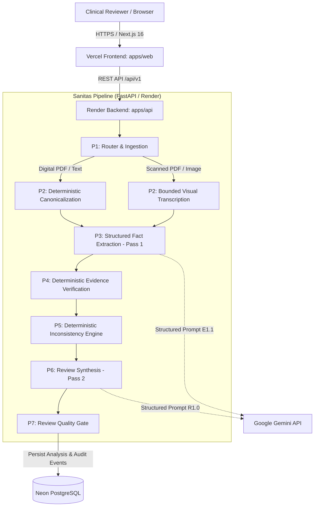

# System Architecture

Sanitas is an AI-assisted clinical document reviewer designed exclusively for synthetic medical documents. The platform consists of two independently deployable applications connected via a typed REST API, backed by PostgreSQL for persistence and Google Gemini for structured reasoning:

---

## 1. Frontend Architecture (`apps/web` on Vercel)

The user interface is built with **Next.js 16 (App Router)**, **React 19**, and **TypeScript**, styled according to the high-contrast **Carbonly** design system:

- **Workbench (`/`)**:
  - Multi-modal tabbed intake supporting synthetic plain-text notes, digital PDF documents, and scanned image uploads (JPEG/PNG).
  - Client-side size and format constraints (max 10 MB, max 50,000 characters).
  - Pre-loaded synthetic clinical demo notes representing diverse clinical encounters.
  - Interactive source document segment drawer with line-level highlighting.
  - Granular results display with tabs for Findings (Concerns, Inconsistencies, Missing Info, Items Requiring Review), Extracted Entities, and Processing Telemetry.
- **Audit History (`/history`)**:
  - Chronological audit ledger of all analyzed synthetic documents.
  - Direct deep-links to durable report views (`/review/[analysis_id]`).
- **Durable Review Route (`/review/[id]`)**:
  - Reloadable analysis permalinks that retrieve full analysis state and canonical segments directly from PostgreSQL.
- **Technical Documentation (`/docs`)**:
  - Six interactive technical chapters with dynamic SVG Mermaid architectural diagrams, pipeline breakdowns, prompt engineering specifications, and REST API schemas.

---

## 2. Backend Architecture (`apps/api` on Render)

The backend is built with **FastAPI** on **Python 3.12**, deployed as a persistent web service on Render managed by Uvicorn (`0.0.0.0:$PORT`):

### 7-Stage Processing Pipeline

1. **Stage P1: Document Ingestion & Routing (`document_router.py`)**:
   - Inspects MIME types and binary headers.
   - Enforces strict bounds: max 10 MB file size, max 15 pages for PDFs, max 50,000 characters for text.
   - Computes SHA-256 digest of incoming content.
   - Routes documents adaptively:
     - Digital PDFs (>=80% text pages) route directly to PyMuPDF text parsing.
     - Scanned or visual PDFs route to bounded visual transcription.
     - JPEG/PNG scans route to visual transcription.
2. **Stage P2: Canonical Document Construction (`canonicalize.py`)**:
   - Segments text into immutable line-level source units (`p{page}-s{seq}`) in natural reading order.
   - Preserves original whitespace and punctuation for exact substring verification.
3. **Stage P3: Fact Extraction (Pass 1 - Prompt E1.1, `gemini.py`)**:
   - Dispatches canonical document segments to Gemini (`gemini-3.8-flash` or `gemini-2.5-flash`).
   - Enforces strict Pydantic JSON Schema (`ClinicalExtraction`).
   - Extracts patient demographics, symptoms, diagnoses, medications, vitals, allergies, observations, and uncertain items.
   - Every entity must include at least one `EvidenceRef` with `segment_id`, `page_number`, and verbatim `quote`.
4. **Stage P4: Deterministic Evidence Verification (`evidence.py`)**:
   - Deterministically verifies that referenced segments exist, page numbers match, and quotes appear as verbatim substrings after whitespace normalization.
   - Rejects ungrounded claims; fails closed with `EVIDENCE_VALIDATION_FAILED`.
5. **Stage P5: Inconsistency Candidate Detection (`inconsistency_rules.py`)**:
   - Deterministic rule engine identifying document-level factual contradictions without medical speculation.
   - Flags allergy contradictions (e.g. "NKDA" alongside a documented penicillin allergy).
   - Flags medication conflicts (e.g. same drug documented as active and discontinued).
   - Flags conflicting vitals timestamps.
6. **Stage P6: Review Synthesis (Pass 2 - Prompt R1.0, `gemini.py`)**:
   - Synthesizes an executive clinical review report (`ClinicalReview`) summarizing documented findings.
   - Contextualizes clinical concerns, candidate inconsistencies, and actionable information gaps.
   - Constrained to descriptive clinical documentation; prohibited from issuing medical directives.
7. **Stage P7: Review Quality Gate (`quality_gate.py`)**:
   - Validates that all entity IDs referenced in review findings exist in Pass 1 extraction output.
   - Validates that all evidence quotes in concerns and inconsistencies match source canonical segments.
   - Secondary safeguard regex scans against prescriptive or imperative directives (`i prescribe`, `patient must take`, etc.).

---

## 3. Persistence & Database Architecture (`Neon PostgreSQL`)

- **ORM Models (`app/db/models.py`)**:
  - `Analysis`: Stores `analysis_id` (UUID primary key), `status`, `source_type`, `sha256`, `canonical_document`, `clinical_extraction`, `clinical_review`, and `timings_ms`. Uses native PostgreSQL `JSONB` with portable fallback to `JSON`.
  - `ProcessingEvent`: Audit log recording pipeline milestones, retry events, and quality gate evaluations.
- **Database Fallback Policy**:
  - In production and development, `DATABASE_URL` is required for persistence. Connection failures surface a typed `DATABASE_UNAVAILABLE` error.
  - SQLite in-memory engine is strictly restricted to automated test fixtures (`is_explicit_test`).
- **Migrations (`alembic/`)**:
  - Version-controlled schema migrations generated and verified via Alembic.

---

## 4. API Endpoints

- `GET /health`: Liveness health check returning service status without external dependencies.
- `POST /api/v1/analyses`: Ingests text (JSON) or files (multipart/form-data), runs the 7-stage review pipeline, persists results, and returns complete analysis.
- `GET /api/v1/analyses`: Paginated list of recent analyses for the audit history ledger.
- `GET /api/v1/analyses/{id}`: Detailed retrieval of an analysis by UUID.
- `GET /api/v1/analyses/{id}/status`: Lightweight status check for long-running analyses.
