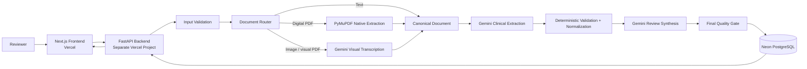
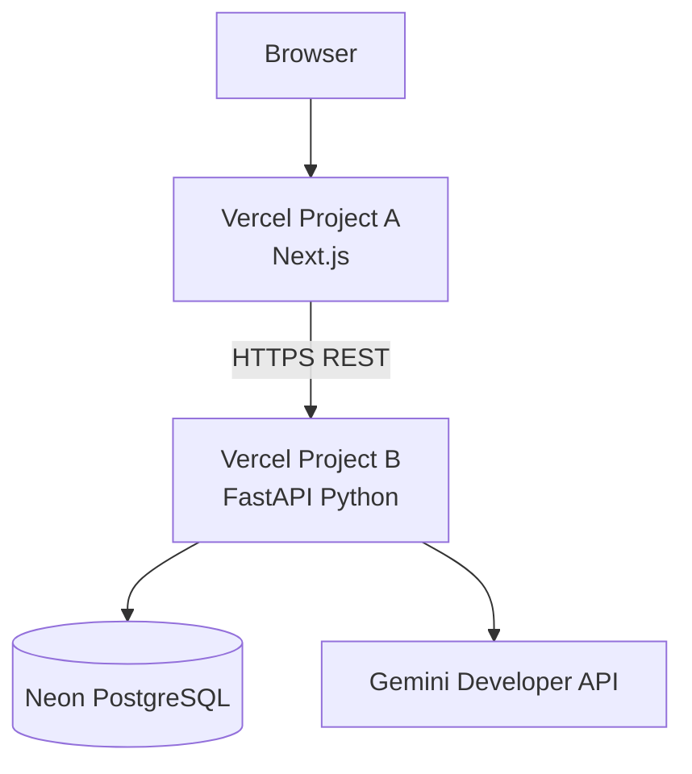

# System Architecture

## Logical architecture



## Deployment architecture



Frontend and backend are separate deployable services and have separate environment-variable scopes.

## Trust boundaries

1. Browser to frontend.
2. Frontend to public backend.
3. Backend to database.
4. Backend to Gemini.
5. Raw file exists only during request processing.

## Module boundaries

### Backend
```text
backend/
  app/
    main.py
    api/
      routes/
        analyses.py
        health.py
      dependencies.py
    core/
      config.py
      logging.py
      errors.py
      security.py
    schemas/
      api.py
      canonical_document.py
      clinical_extraction.py
      clinical_review.py
      errors.py
    services/
      ingestion.py
      document_router.py
      pdf_service.py
      image_service.py
      canonicalizer.py
      clinical_extractor.py
      validators.py
      inconsistency_rules.py
      review_generator.py
      quality_gate.py
      pipeline.py
      timing.py
      gemini_client.py
    db/
      models.py
      session.py
      repositories/
        analyses.py
      migrations/
    tests/
      unit/
      integration/
      evals/
```

### Frontend
```text
frontend/
  app/
    page.tsx
    review/new/page.tsx
    review/[id]/page.tsx
    history/page.tsx
  components/
    upload/
    processing/
    report/
    evidence/
    history/
    states/
  lib/
    api.ts
    schemas.ts
    query-client.ts
    formatters.ts
  tests/
```

## Synchronous baseline

The assignment version uses a synchronous analysis request.

Reason:
- no free reliable Python queue/worker is required
- document limits are bounded
- Vercel Hobby permits up to 300 seconds
- complexity stays proportional

The database status is updated at each pipeline stage for auditing. The client request remains open until completion or typed failure.

If benchmark p95 becomes too high or timeouts occur, asynchronous execution becomes a measured follow-up rather than pre-emptive complexity.
